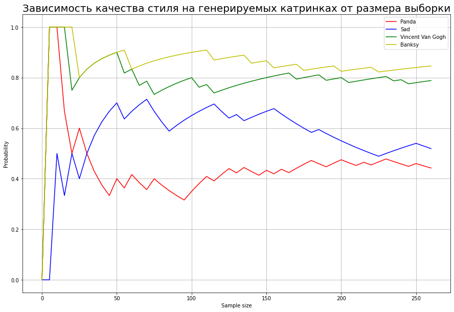
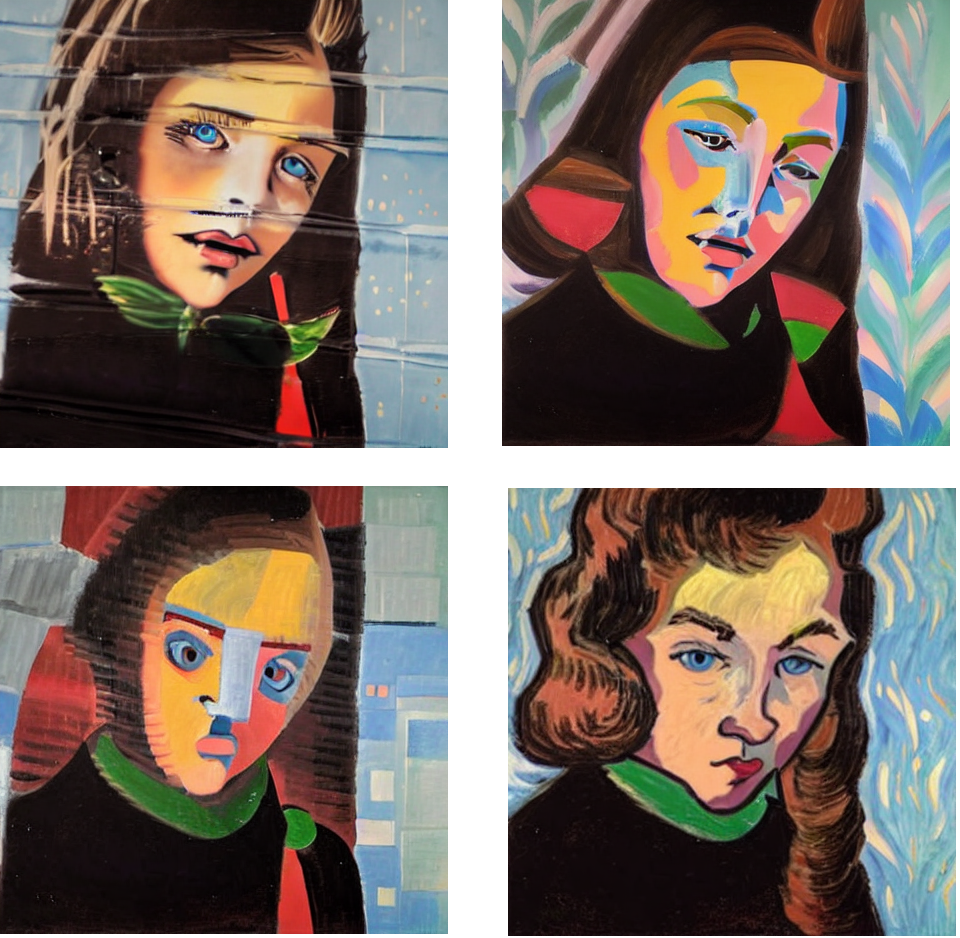
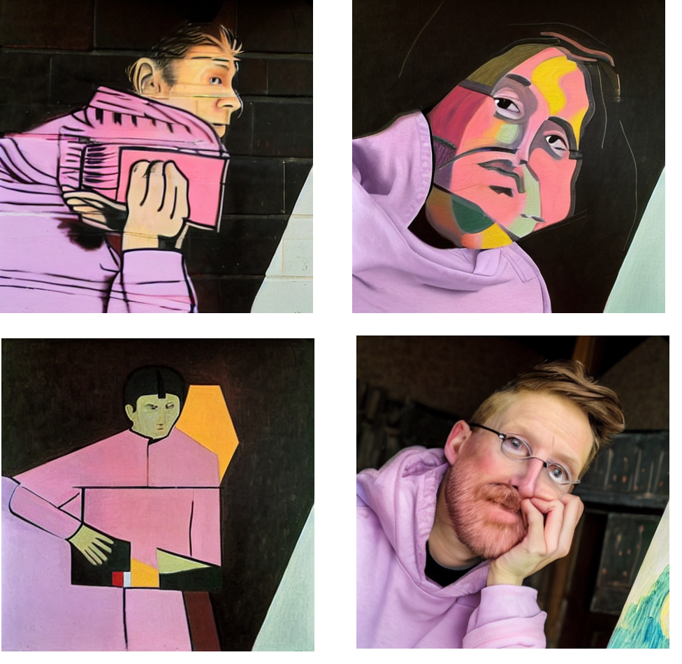
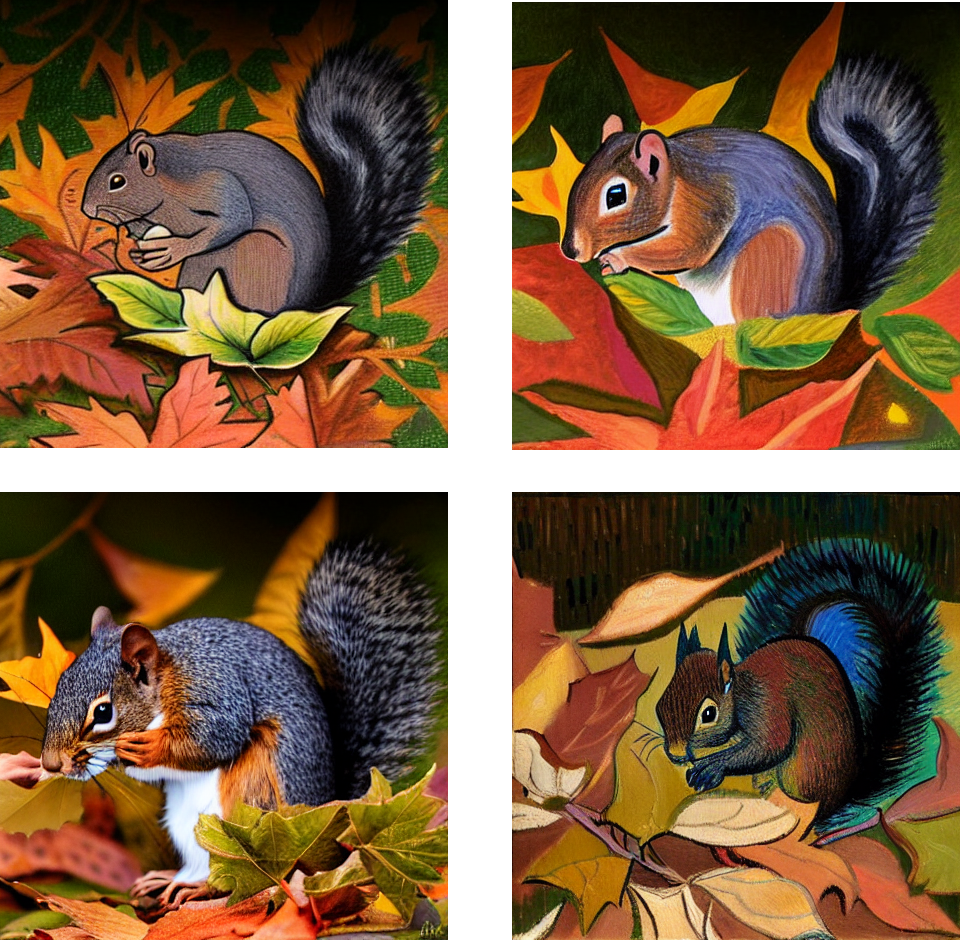
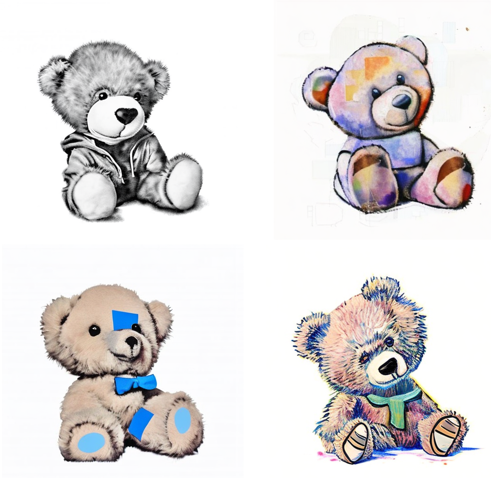

# Тематическая генерация изображений с помощью библиотеки Stable Diffusion. 
Немного про библиотеку Stable Diffusion: она создает изображение и имеет дату релиза 22 августа 2022, у нее есть 2 версии text2image и image2image.

В данной работе используется версия image2image: на вход подается изображение и описание изображения сгенерированное с помощью модели LAVIS; на базе исходного изображения и текста генерируется новое изображение.
### Поставленные задачи: 
1) собрать датасет разнообразных изображений, на которых будет проверяться генерация изображений (для понимания, на чем лучше работает)
2) выяснить на каких стилях лучше работает  SD,  понять за счет чего можно улучшить результат SD
3) разработать метрику для определения лучших стилей
4) разработать модель удобную для пользователя
5) при этом модель должна быть быстрой и легковесной для реализации.

### Результаты по задачам:
1) Было разработано 2 датасета: 12 изображений и 250 изображений (с людьми, животными, персонажами из фильмов и мультфильмов, пейзажами и натюрмортами)
2) Для сравнения использовались стили: изменение фона (Диснейленд); эмоции (радость, грусть); маска панда; стили художников (Бэнкси, Робер Делоне, Казимир Малевич и Винсент Ван Гог). 

    Было проверено 2 архитектуры: по изображению пользователя генерируется описание и по этому описанию + стиль создается новое изображение; во второй модели еще используется изображение пользователя  + его описание + стиль. 
    Вторая модель показала результаты более приближенные к исходному изображению, но не всегда стабильные. Для выбора стилей была разработана метрика.

3) При выборе стилей для генерации разработана метрика. С помощью модели LAVIS определяется соответствует ли данное изображение стилю (за ответ да 1, за нет 0), данные ответы суммируются и делятся на количество изображений. Построен график на датасете. Лучшие результаты показали стили художников.

4) Архитектура полученной модели. По изображению создается ее описание в модели LAVIS. Далее описание и выбранный пользователем стиль передаются в Stable Diffusion. Пользователь на вход подает изображение и получает 4 сгенерированных изображения в стилях художников: Бэнкси, Робер Делоне, Казимир Малевич и Винсент Ван Гог
5) Модель весит 10Гб и на 12 Гб считает около 2-3 минут

### Примеры:

##### Оригиналы

##### Пример 1

##### Пример 2

##### Пример 3

##### Пример 4

